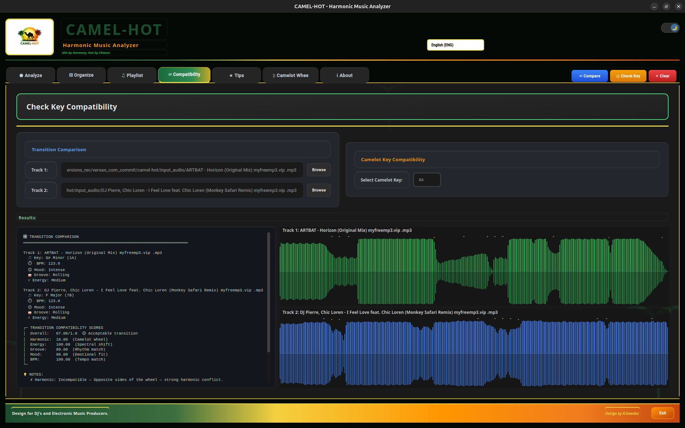

# 🐪 Camel-Hot — DJ Harmonic Analyzer

> Analyze audio files, detect musical keys and BPM, organize your library by Camelot notation, and generate harmonic mixing playlists — all from a clean PyQt5 desktop GUI.

[](https://github.com/your-username/camel-hot/actions/workflows/ci.yml)
[](https://www.python.org/downloads/)
[](https://pypi.org/project/PyQt5/)
[](LICENSE)

---

## Features

| Feature | Details |
|---------|---------|
| 🎵 **Key Detection** | Chroma-based analysis via librosa; outputs musical key + Camelot code |
| 🥁 **BPM Detection** | Onset-based tempo estimation |
| ⚡ **Energy Analysis** | Brightness, density, energy curve classification |
| 🎶 **Groove Detection** | Kick presence, swing, percussion density |
| 😊 **Mood Classification** | Major/minor tonality, aggressiveness, tension, brightness |
| 📁 **Library Organizer** | Batch-copies files into `CH_Org[N]/[key]_Camelot/` hierarchy |
| 🎧 **Playlist Generator** | 4 strategies: harmonic, harmonic sequence, key-to-key, Camelot zone |
| ↔️ **Transition Scoring** | 0–1 compatibility rating across harmonic, BPM, groove, mood, energy dimensions |
| 🌙 **Day / Night Theme** | Full dark/light theme toggle |
| 🌐 **Multi-language** | English, Portuguese, Spanish |
| 📊 **Camelot Wheel** | Built-in interactive Camelot wheel visualization |
| 📈 **Real-time Progress** | Animated per-file progress dialog with live speed/ETA stats |

---

## Screenshots



---

## Installation

### Requirements

- Python 3.8 or higher
- `libsndfile` and `ffmpeg` (system packages — see platform notes below)

### Platform notes

| Platform | Command |
|----------|---------|
| Ubuntu / Debian | `sudo apt install libsndfile1 ffmpeg` |
| Fedora / RHEL | `sudo dnf install libsndfile ffmpeg` |
| macOS | `brew install libsndfile ffmpeg` |
| Windows | Install [FFmpeg](https://ffmpeg.org/download.html) and add to PATH |

### Setup

```bash
# 1. Clone
git clone https://github.com/your-username/camel-hot.git
cd camel-hot

# 2. Create and activate a virtual environment
python3 -m venv .venv
source .venv/bin/activate          # Windows: .venv\Scripts\activate

# 3. Install Python dependencies
pip install -r requirements.txt

# 4. Verify the installation
python test_setup.py
```

### Run

```bash
python main.py
```

Or use the convenience script (activates venv, checks deps, launches GUI):

```bash
./run.sh
```

---

## Usage

### Analyze tab

Point at a single audio file and click **Analyze**. The app reports key, Camelot code, BPM, energy level, groove type, mood, and transition potential.

### Organize tab

1. Select an **Input Folder** (your music library).
2. Select an **Output Folder** (where organized files will go).
3. Click **Organize** — a naming dialog lets you choose the collection name (default: `CH_Org1`, auto-incremented).
4. Files are **copied** into `[output]/[CH_OrgN]/[key]_Camelot/` by default. Enable *Move Files* to remove originals.

### Playlist tab

Choose one of four strategies and click **Generate Playlist**. A `.m3u` file is written to the location you specify.

| Strategy | What it does |
|----------|-------------|
| **Harmonic** | Filters tracks by key compatibility, optional BPM range |
| **Harmonic Sequence** | Follows the Camelot wheel clockwise/counter-clockwise |
| **Key-to-Key** | Finds the smoothest harmonic path between two keys |
| **Camelot Zone** | Groups tracks within N positions of a target key |

### Compatibility tab

Load two audio files and click **Compare**. The transition score table shows harmonic, BPM, groove, mood, and energy sub-scores.

---

## Project Structure

```
camel-hot/
├── main.py                      # Entry point
├── config.py                    # All constants and path helpers
├── logging_config.py            # Log rotation and level control
├── requirements.txt
├── pyproject.toml               # Packaging metadata + pytest/coverage config
│
├── audio_analysis/              # Business logic — no PyQt5 here
│   ├── key_detection.py         # analyze_track() orchestrator
│   ├── energy_detection.py
│   ├── groove_analysis.py
│   └── mood_classification.py
│
├── gui/
│   ├── main_window.py           # PyQt5 window, QThread workers, dialogs
│   └── file_manager/
│       └── organizer.py         # File discovery, organize, M3U generation
│
├── utils/
│   ├── camelot_map.py           # CAMELOT_MAP + compatibility helpers
│   ├── transition_scoring.py    # Multi-dimension transition scoring
│   ├── translations.py          # i18n strings
│   └── dj_tips.py               # Contextual DJ tips
│
├── tests/
│   ├── conftest.py              # Shared fixtures
│   └── unit/                    # Fast unit tests (no audio files needed)
│
├── docs/
│   ├── ARCHITECTURE.md
│   ├── CAMELOT_SYSTEM.md
│   ├── CONFIGURATION.md
│   └── CONTRIBUTING.md
│
└── assets/                      # Images used by the GUI
```

---

## Development

### Run tests

```bash
# Unit tests only (fast — no audio files, no display required)
python -m pytest tests/unit/ -v

# With coverage report
python -m pytest tests/unit/ \
    --cov=audio_analysis --cov=gui/file_manager --cov=utils --cov=config \
    --cov-report=term-missing
```

### Code style

```bash
pip install flake8
flake8 . --select=E9,F63,F7,F82 --exclude=venv,.venv
```

See [docs/CONTRIBUTING.md](docs/CONTRIBUTING.md) for the full developer guide: branching model, commit conventions, architecture rules, and PR process.

---

## How it works

### Analysis pipeline

```
Audio file
  │
  ├─→ detect_key_from_audio()  →  key + Camelot code + confidence
  ├─→ detect_bpm()             →  BPM
  ├─→ analyze_groove()         →  kick/swing/percussion profile
  ├─→ classify_mood()          →  tonality / aggressiveness / tension
  └─→ analyze_energy()         →  level / brightness / density / curve
  │
  └─→ analyze_track() dict  ←  consumed by GUI, organizer, playlist, scoring
```

### Camelot compatibility rules

Two tracks are harmonically compatible if their Camelot codes differ by:

- **0** — same key
- **0, A↔B** — relative major/minor (same number, different letter)
- **±1** — adjacent position on the wheel

`utils/camelot_map.py` implements all compatibility checks and provides a 0–100 score.

---

## Supported audio formats

`.mp3` · `.wav` · `.flac` · `.ogg` · `.m4a` · `.aac` · `.aiff`

---

## Troubleshooting

**GUI fails to launch**
```bash
python -c "from gui.main_window import DJAnalyzerGUI"
```
Shows the exact import error.

**Key detection returns "Unknown"**
- Check librosa is installed: `pip show librosa`
- Check the file is valid: try playing it in another app
- See `logs/dj_analyzer.log` for the full error

**`libsndfile` not found on Linux**
```bash
sudo apt install libsndfile1
```

---

## Contributing

Pull requests are welcome! Please read [docs/CONTRIBUTING.md](docs/CONTRIBUTING.md) first.

Open a [bug report](.github/ISSUE_TEMPLATE/bug_report.yml) or [feature request](.github/ISSUE_TEMPLATE/feature_request.yml) using the GitHub issue templates.

---

## License

[MIT](LICENSE) © 2026 Camel-Hot contributors

